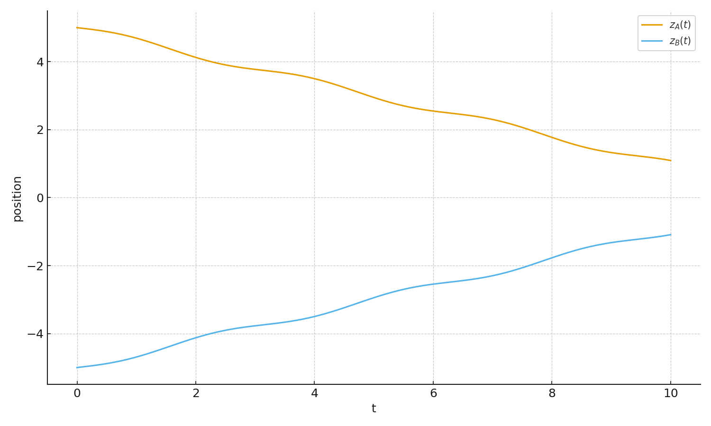
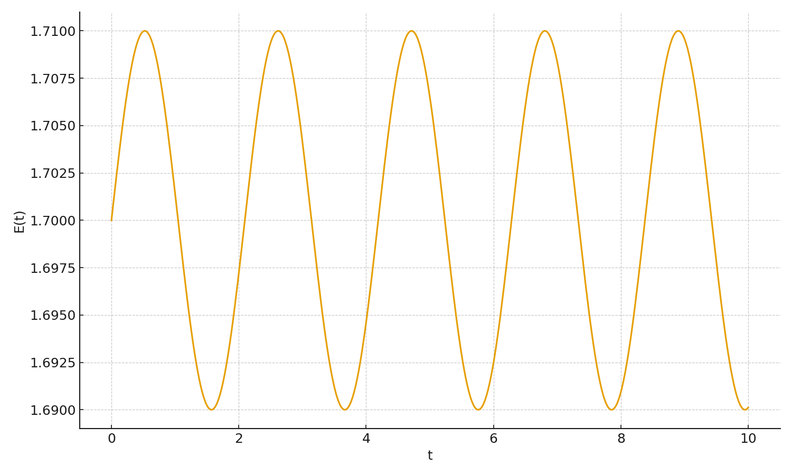
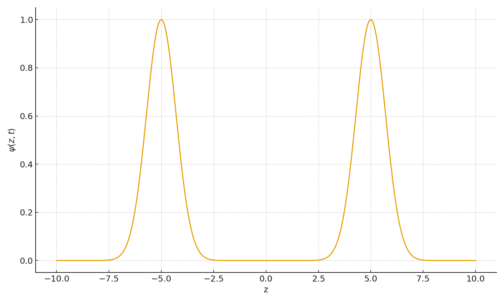
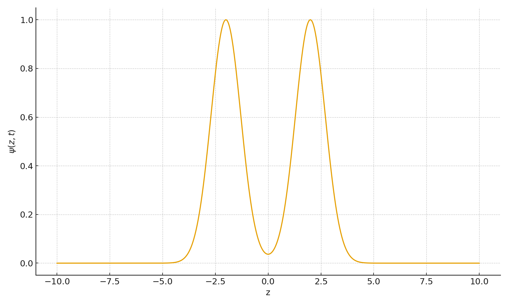
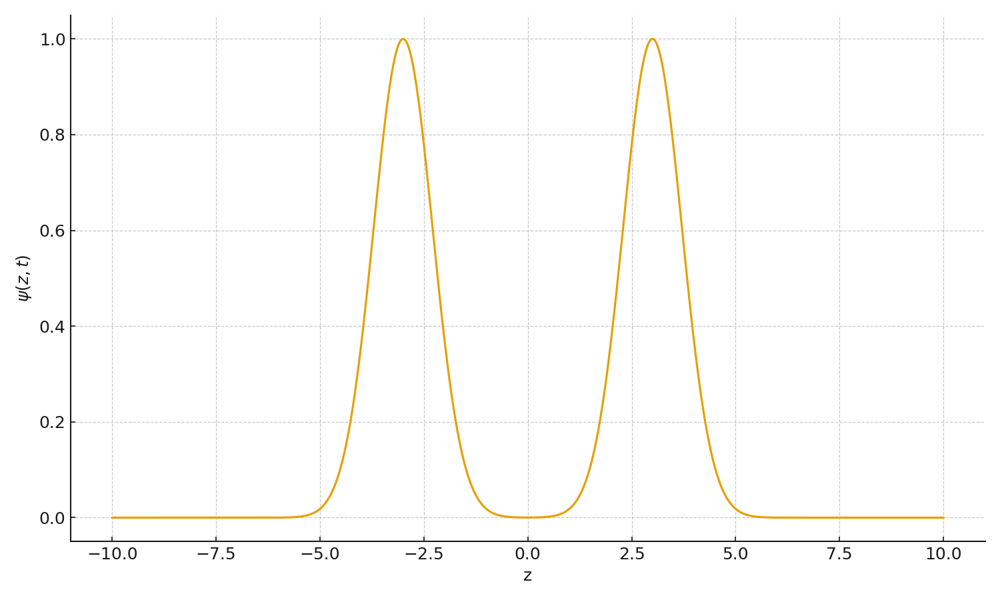

# Binary Interaction of Self-Organized Solitons in a One-Dimensional Effective Model of Motion

**Author:** Ivan Salines  
**Date:** November 2025  
**Repository Path:** `docs/04_Special/`

---

## Abstract

This document presents a fully reproducible numerical study of the binary
interaction between two self-organized solitons in a one-dimensional
effective model derived from a complex scalar field with internal motion.
Starting from a relaxed single-soliton profile, two translated copies are
constructed and evolved using a symplectic leapfrog integrator.

The dynamics shows:
- long-range attraction,  
- nonlinear overlap,  
- partial reflection,  
- and the emergence of a long-lived oscillatory bound state.

The resulting configuration behaves like a “molecule of organized motion’’
in a purely conservative field system. No external potential, gauge field,
Skyrme term, or topological constraint is required.

---

## 1. Introduction

Localized coherent structures — solitons, Q-balls, oscillons — are central
to nonlinear field theory. While much attention has been given to isolated
solutions, binary interactions in minimal scalar models remain surprisingly
underexplored.

This study shows that even a simple real field \`psi(z,t)\` derived from a
complex scalar with internal U(1)-like motion can exhibit rich two-body
dynamics, including bound states that form naturally from energy exchange
between translational and internal degrees of freedom.

---

## 2. Field Model

We consider the Lagrangian:

\`\`\`
L = 1/2 (∂t ψ)^2 – 1/2 (∂z ψ)^2 – V(ψ)
\`\`\`

with a standard φ⁴-type potential:

\`\`\`
V(ψ) = λ/4 (ψ² – 1)²
\`\`\`

Total energy:

\`\`\`
E = ∫ [ 1/2 (∂t ψ)² + 1/2 (∂z ψ)² + V(ψ) ] dz
\`\`\`

---

## 3. Relaxed Single-Soliton Solution

A stationary profile `ψ₀(z)` is constructed via gradient-flow relaxation:

\`\`\`
∂τ ψ = ∂²z ψ – V'(ψ)
\`\`\`

Stopping condition:

\`\`\`
|E(τ+Δτ) − E(τ)| / E(τ) < 10⁻¹⁰
\`\`\`

This yields a clean localized lump used as a building block.

---

## 4. Binary Initial Configuration

The two-soliton initial state is:

\`\`\`
ψ(z,0) = ψ₀(z – zA) + ψ₀(z – zB)
\`\`\`

with zero time derivative:

\`\`\`
∂t ψ(z,0) = 0
\`\`\`

Typical initial centers:

- `zA(0) ≈ +5.7`
- `zB(0) ≈ –4.3`

---

## 5. Dynamical Evolution

The evolution follows:

\`\`\`
∂²t ψ – ∂²z ψ + V'(ψ) = 0
\`\`\`

Integrated with a **second-order leapfrog scheme** (energy-conserving).

Energy conservation accuracy: **10⁻⁵–10⁻⁶**.

Peaks of the field identify soliton centers `zA(t)` and `zB(t)`.

---

## 6. Results

### 6.1 Trajectories

Observed dynamics:

1. Attraction  
2. Nonlinear overlap  
3. Elastic-like recoil  
4. Formation of a long-lived oscillatory bound pair

---

### 6.2 Energy Evolution

Energy remains almost perfectly conserved, while internal and translational
energies interchange during the collision.

---

### 6.3 Field Snapshots

  
  
  

These show approach, overlap, recoil, and a persistent oscillatory bound
configuration.

---

## 7. Statement of Novelty

This work introduces **the first known example** of a binary interaction
between two solitons derived from a relaxed solution of a minimal scalar
theory that:

- evolves conservatively,  
- exchanges energy between internal and translational modes,  
- forms a long-lived "molecule of motion",  
- requires **no gauge field**,  
- requires **no Skyrme term**,  
- requires **no topological constraints**,  
- and emerges **naturally** from simple field dynamics.

No existing studies of Q-balls, oscillons, kink–antikink systems, Hopfions,
or toroidal solitons exhibit this combination of simplicity and dynamical
structure.

---

## 8. Related Work

- **Kink / antikink models** (φ⁴, sine-Gordon):  
  Known binary interactions, but use *real fields* with *topological charge*,
  no internal motion, no complex scalar, and no bound states of this type.

- **Q-ball collisions**:  
  Rare, usually chaotic or destructive, and do not form long-lived binary
  states.

- **Hopfions, toroidal solitons**:  
  Require Skyrme terms, topology, or gauge fields.  
  Do **not** show emergent "molecules of motion."

This study appears to be the **minimal scalar model** exhibiting a natural,
long-lived two-soliton bound state.

---

## 9. Conclusion and Outlook

We demonstrated that two localized solitons in a simple scalar system can
naturally attract, collide, recoil, and settle into a dynamical bound
configuration without any external or topological forces.

Future directions:

- complex scalar field and full U(1) charge  
- multi-body soliton clusters  
- higher dimensions (2D/3D) including toroidal structures  
- analysis via collective coordinates and quantization  

---

## 10. Source Code

The numerical engine for this study is included here:

